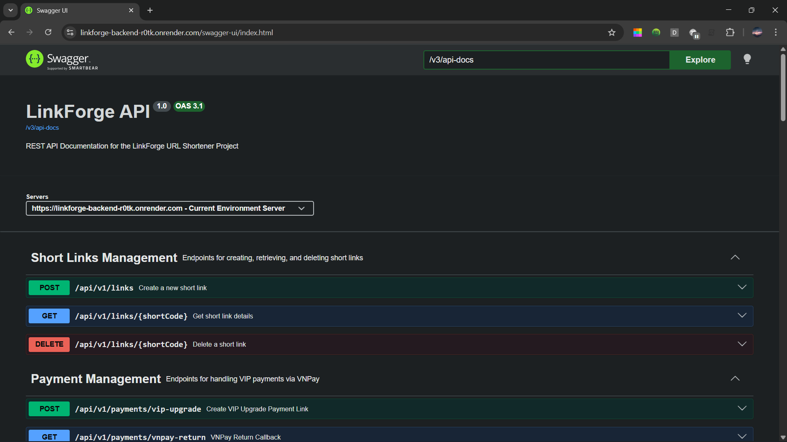
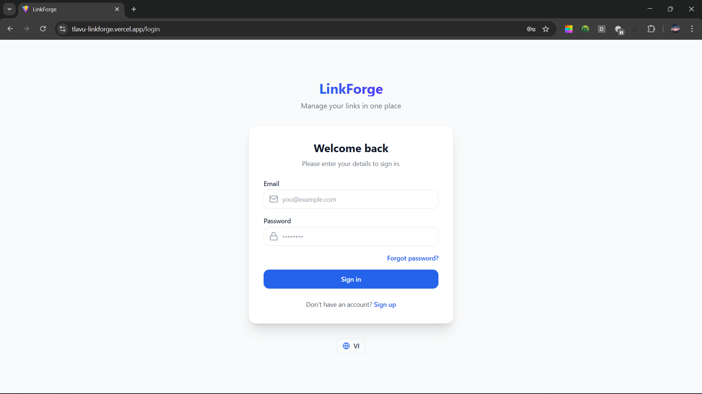
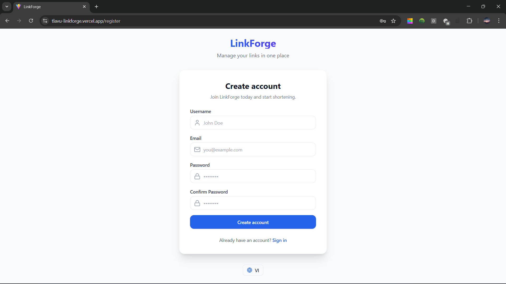
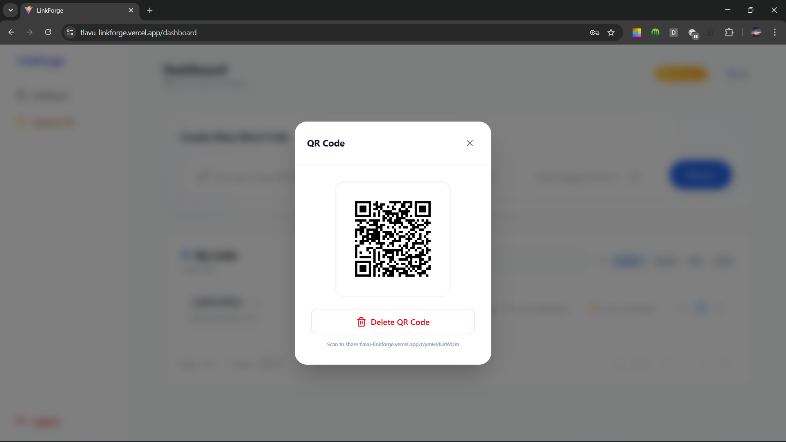
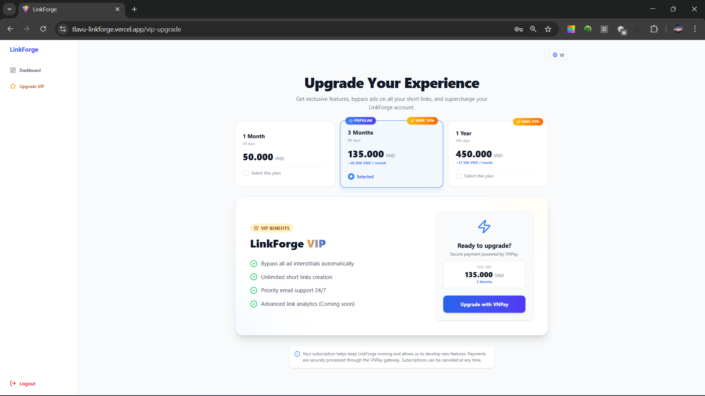
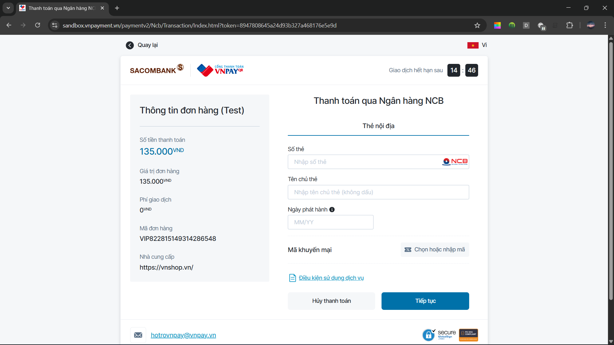
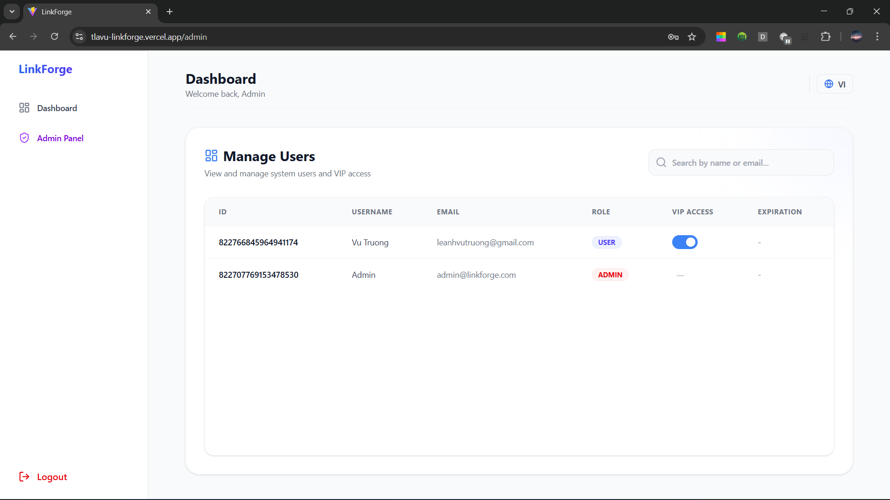

LinkForge is a full-featured URL shortening and link management platform built with **Java 21** and **Spring Boot 3**. It's designed with a **Headless Backend Architecture** — providing the core API and infrastructure (Database + Caching) as a single bundled unit, ready for integration with any frontend.


> [!NOTE]
> This is a **Full Backend Infrastructure Bundle** (REST API + PostgreSQL + Redis).
> The **Frontend** (React + TypeScript) is managed in a separate repository: [linkforge-frontend](https://github.com/tlavu2004/linkforge-frontend)

---

## Table of Contents

- [Key Features](#key-features)
- [Architecture](#architecture)
- [Tech Stack](#tech-stack)
- [API Overview](#api-overview)
- [Getting Started](#getting-started)
- [Environment Variables](#environment-variables)
- [Deployment](#deployment)
- [Usage Guide](#usage-guide)
- [Authors](#authors)
- [License](#license)

---

## Key Features

### URL Shortening
Anyone (including unauthenticated users) can shorten a URL. Each short link is assigned a unique code via TSID (Time-Sorted Unique Identifier). Links can optionally have:
- A **custom alias** instead of the auto-generated code.
- An **expiration date**, after which the link becomes inactive.
- A **delete token** returned upon creation so the link owner can remove it later without needing an account.

### Authenticated User Dashboard
Registered users get their own dashboard to manage all their created links, including:
- **Paginated, sortable, searchable** list of links with full metadata.
- Ability to **delete** their own links without a delete token.
- **QR Code generation** for any of their links (VIP/Admin only).

### QR Code Generation
VIP users and Admins can generate a QR code for any link they own. The QR code is created server-side using ZXing, encoded as a Base64 PNG, and stored alongside the link record.

### Advanced Analytics
Detailed click tracking with real-time data collection:
- **Geolocation**: Identify visitor country and city via IP-to-location.
- **Device Detection**: Track device types (Mobile, Desktop, Tablet, etc.) using User-Agent parsing.
- **Referrer Tracking**: Analyze where your traffic is coming from.
- **Time-series Data**: Visualize click trends over time with aggregated statistics.

### Localization (i18n)
Full internationalization support for both English (`en`) and Vietnamese (`vi`):
- Localized API error messages and success responses.
- Multilingual email templates for registration and password reset.
- Automatic language detection based on the `Accept-Language` header.

### Ad Interstitials (Monetization Layer)
Non-VIP users are shown an interstitial ad page before being redirected to the destination URL. The flow works as follows:
1. User visits `/r/{shortCode}`.
2. Backend checks if the link owner is VIP — if yes, the user is redirected immediately (301).
3. If not VIP, a temporary **ad token** is generated (stored in Redis with a 30-second TTL) and the user is redirected (302) to a frontend buffer page.
4. The frontend shows the ad for 5 seconds, then calls `POST /api/v1/ads/verify` with the token.
5. Backend verifies the token has existed for at least 5 seconds, then returns the original URL.

### VIP Packages & VNPay Payments
Users can purchase VIP packages that unlock premium features (ad-free redirects, custom aliases, QR code generation, etc.). Payment is processed via **VNPay**:
- `POST /api/v1/payments/vip-upgrade` creates a VNPay checkout URL for the selected package.
- `GET /api/v1/payments/vnpay-return` handles the return callback — verifies the transaction signature, updates the user's VIP status and expiration, and redirects to the frontend.

Available VIP packages are Monthly, Yearly, and Lifetime options.

### Authentication & Security
Full authentication system with the following features:
- **Registration** with email verification via OTP (sent through SMTP).
- **Login** returns a JWT access token + refresh token.
- **Refresh Token** rotation — old tokens are invalidated when refreshed.
- **Forgot/Reset Password** flow using OTP verification.
- **Role-Based Access Control:** `USER` and `ADMIN` roles with method-level `@PreAuthorize` guards.

### Admin Panel
Admins have access to additional endpoints for managing the entire platform:
- **User Management:** List all users (paginated, searchable), toggle VIP status.
- **Link Management:** View, delete, and manage QR codes for any user's links.

### Observability
- **Spring Boot Actuator** exposes `/actuator/health`, `/actuator/info`, and `/actuator/prometheus` endpoints.
- **Prometheus** metrics endpoint for integration with monitoring stacks (Grafana, etc.).

---

## Architecture

The project follows **Clean Architecture** (Hexagonal Architecture) with four clearly separated layers:

```
src/main/java/com/tlavu/linkforge/
├── domain/            # Core business logic — entities, value objects, repository interfaces, exceptions
├── application/       # Use cases (business orchestration), DTOs, port interfaces
├── infrastructure/    # External concerns — persistence (JPA), security (JWT), cache (Redis), email, metrics
└── presentation/      # REST controllers, request/response wrappers, global exception handling
```

- **Domain Layer** contains pure business entities (`ShortLink`, `User`, `PaymentTransaction`, `RefreshToken`, `VipPackage`) and value objects (`OriginalUrl`, `ShortCode`) with no framework dependencies.
- **Application Layer** defines use cases like `CreateShortLinkUseCase`, `AuthUseCase`, `HandlePaymentWebhookUseCase`, etc. Each use case follows the single-responsibility principle.
- **Infrastructure Layer** implements technical details:
  - **Multi-level Caching**: L1 (Caffeine In-memory) + L2 (Redis) for high-performance redirection.
  - **Table Partitioning**: PostgreSQL native monthly partitioning for the `short_links` table to handle massive scale.
  - **Security**: JWT-based auth with refresh token rotation and role-based access control.
  - **Rate Limiting**: IP-based protection powered by Redis Lua scripts.
  - **Observability**: Prometheus metrics and structured JSON logging.
- **Presentation Layer** exposes the REST API with standardized `ApiResponse<T>` wrappers and a `GlobalExceptionHandler`.

---

## Tech Stack

| Category | Technology |
| :--- | :--- |
| Language | Java 21 |
| Framework | Spring Boot 3.5.10 |
| Security | Spring Security + JWT (jjwt 0.12.7) |
| Database | PostgreSQL 16 |
| Caching | Redis + Caffeine (L1/L2 Strategy) |
| DB Migration | Flyway |
| ORM | Spring Data JPA / Hibernate |
| ID Generation | Hypersistence TSID (Base62) |
| Object Mapping | MapStruct + Lombok |
| QR Code | Google ZXing |
| API Docs | SpringDoc OpenAPI 2.8 (Swagger UI) |
| Monitoring | Spring Actuator + Micrometer Prometheus |
| Email | Spring Mail (Gmail / Brevo SMTP) + Thymeleaf |
| Testing | JUnit 5, Spring Security Test, Testcontainers |
| Containerization | Docker (multi-stage build) + Docker Compose |
| Deployment | Render (backend), Vercel (frontend) |

---

## API Overview

Base path: `/api/v1`

| Group | Prefix | Description |
| :--- | :--- | :--- |
| **Authentication** | `/auth` | Register, verify email, login, refresh token, logout, forgot/reset password, get profile |
| **Short Links** | `/links` | Create, retrieve, and delete short links (public, token-based) |
| **My Links** | `/me/links` | Authenticated user's link dashboard — list, delete, generate/delete QR codes |
| **Redirection** | `/r/{shortCode}` | Redirect short codes to original URLs (with ad interstitial logic) |
| **Advertisements** | `/ads` | Verify ad tokens after interstitial wait |
| **Payments** | `/payments` | Create VNPay checkout URL, handle return callback |
| **Admin - Users** | `/admin/users` | List users, toggle VIP status |
| **Admin - User Links** | `/admin/users/{userId}/links` | View/delete/manage QR for any user's links |

Interactive API documentation is available at:
```
http://localhost:8080/swagger-ui/index.html
```



---

## Getting Started

### Prerequisites
- **Java 21+**
- **Maven 3.9+**
- **Docker & Docker Compose** (for infrastructure services)

### Option 1: Full Infrastructure Bundle (Recommended)

This is the fastest way to run the complete backend infrastructure. It will spin up PostgreSQL, Redis, and the Spring Boot application together as a single unit:

```bash
# 1. Clone the repository
git clone https://github.com/tlavu2004/linkforge-backend.git
cd linkforge-backend

# 2. Get environment files
# Option A: Create from example
cp .env.example .env
# Edit .env and fill in your JWT_SECRET_KEY and other required values.

# Option B: Download pre-configured files
# Download .env or .env.prod from [Google Drive Link](LINK_DRIVE_HERE)
# and save it to the project root.

# 3. Start everything
docker compose up -d
```

The app will be available at `http://localhost:8080`.

### Option 2: Local Development (Infrastructure in Docker)

Run only PostgreSQL and Redis in Docker, and the application natively:

```bash
# 1. Start database and cache
docker compose up -d postgres redis

# 2. Get environment file
# Option A: cp .env.example .env && (Configure .env)
# Option B: Download from [Google Drive](LINK_DRIVE_HERE) to the project root.

# 3. Run the application
mvn spring-boot:run
```

### Admin Account

On first startup, a default admin account is automatically seeded using the values from `ADMIN_EMAIL` and `ADMIN_PASSWORD` environment variables. You can use this account to access admin-only endpoints.

### Maintenance Scripts

LinkForge provides utility scripts for infrastructure cleanup (located in `src/main/resources/scripts`):
- `clean-postgres.sh`: Flushes all data from the PostgreSQL database (use with care!).
- `clean-redis.sh`: Clears all keys from the Redis instance.

Usage:
```bash
./src/main/resources/scripts/db/clean-postgres.sh ./.env
./src/main/resources/scripts/redis/clean-redis.sh ./.env
```

---

## Environment Variables

You have two ways to configure your environment:
1.  **Manual**: Copy `.env.example` to `.env` and fill in the required values.
2.  **Download**: Get pre-configured `.env` (Dev) and `.env.prod` (Production) files from this **[Google Drive Link](LINK_DRIVE_HERE)**.

> [!IMPORTANT]
> Always ensure your `.env` file is in the root directory before running the application or Docker.

### Required

| Variable | Description |
| :--- | :--- |
| `JWT_SECRET_KEY` | Secret key for signing JWT tokens. Generate one with `openssl rand -base64 64`. |
| `DB_URL` | PostgreSQL JDBC URL (default: `jdbc:postgresql://localhost:5432/linkforge`) |
| `DB_USERNAME` | Database username (default: `postgres`) |
| `DB_PASSWORD` | Database password (default: `password`) |

### Optional

| Variable | Description | Default |
| :--- | :--- | :--- |
| `SPRING_PROFILES_ACTIVE` | Active Spring profile | `dev` |
| `PORT` | Server port | `8080` |
| `JWT_EXPIRATION` | Access token TTL (ms) | `900000` (15 min) |
| `JWT_REFRESH_TOKEN_EXPIRATION` | Refresh token TTL (ms) | `604800000` (7 days) |
| `REDIS_HOST` | Redis server hostname | `localhost` |
| `REDIS_PORT` | Redis server port | `6379` |
| `FRONTEND_URL` | Frontend base URL (for CORS & redirects) | `http://localhost:5173` |
| `ADMIN_EMAIL` | Default admin email | `admin@linkforge.com` |
| `ADMIN_PASSWORD` | Default admin password | `admin123` |

### VNPay (Required for Payments)

| Variable | Description |
| :--- | :--- |
| `VNPAY_TMN_CODE` | Merchant terminal code from VNPay |
| `VNPAY_HASH_SECRET` | Secure hash key from VNPay |
| `VNPAY_URL` | VNPay payment gateway URL |
| `VNPAY_RETURN_URL` | Callback URL after payment (e.g. `http://localhost:8080/api/v1/payments/vnpay-return`) |
| `VNPAY_API_URL` | VNPay transaction query API |

### Geolocation & Analytics

| Variable | Description | Default |
| :--- | :--- | :--- |
| `IP_API_URL` | IP Geolocation API URL | `https://ip-api.com/json/` |

### Email / SMTP (Required for Registration & Password Reset)

| Variable | Description | Default |
| :--- | :--- | :--- |
| `MAIL_HOST` | SMTP server hostname | `smtp.gmail.com` |
| `MAIL_PORT` | SMTP port | `587` |
| `MAIL_USERNAME` | SMTP username/email | — |
| `MAIL_PASSWORD` | SMTP password or app password | — |
| `MAIL_FROM` | Sender email address | `noreply@linkforge.com` |

---

## Deployment

### Backend — Render

The project includes a `render.yaml` Blueprint and a multi-stage `Dockerfile` optimized for Render's free tier (512MB RAM):

```dockerfile
ENTRYPOINT ["java", "-XX:MaxRAMPercentage=75.0", "-XX:ActiveProcessorCount=1", "-jar", "app.jar"]
```

Set `SPRING_PROFILES_ACTIVE=prod` and configure all required environment variables in Render's dashboard.

### Frontend — Vercel

The frontend repository includes a `vercel.json` for deployment to Vercel. See the [frontend README](https://github.com/tlavu2004/linkforge-frontend) for details.

---

## Usage Guide

### Getting Started as a User
1. **Register** a new account with email verification (OTP sent to your inbox).
2. **Login** to access your personal dashboard.





### Shortening URLs
1. Paste any long URL into the input field — no account required.
2. Optionally set a **custom alias** and **expiration date**.
3. Click **Shorten** — your new short link and **delete token** are displayed immediately.


### Link Management Dashboard
1. Navigate to **My Links** to view all your created links.
2. Use **search**, **sort**, and **pagination** to find specific links.
3. **Delete** links or **generate QR codes** (VIP/Admin) directly from the table.


### QR Code Generation (VIP / Admin)
1. Open any link from your dashboard.
2. Click the **QR Code** button to generate a scannable QR code.
3. The QR code can be downloaded or regenerated at any time.



### VIP Upgrade & Payments
1. Navigate to the **VIP Upgrade** page.
2. Choose a package: **Monthly**, **Yearly**, or **Lifetime**.
3. Complete payment through the **VNPay** gateway.
4. Enjoy ad-free redirects, QR code generation, and premium features.





### Admin Portal
1. Login with an **Admin** account.
2. Navigate to **Admin Dashboard** to manage users and links.
3. **Toggle VIP status** for any user, or view/delete any link on the platform.



---

## Authors

| Student ID | Full Name | Github |
| :--- | :--- | :--- |
| **22120443** | Trương Lê Anh Vũ | [tlavu2004](https://github.com/tlavu2004) |

---

## Contribution

1. Fork the repository.
2. Create a feature branch (`git checkout -b feature/AmazingFeature`).
3. Commit your changes (`git commit -m 'Add some AmazingFeature'`).
4. Push to the branch (`git push origin feature/AmazingFeature`).
5. Open a Pull Request.

---

## License

This project is licensed under the [MIT License](LICENSE).
